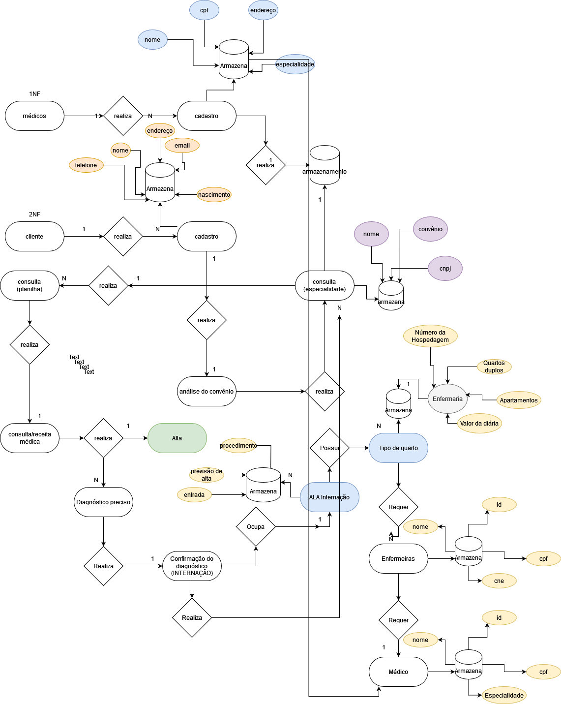

<h2> DATAMED </h2>

<h3>Este projeto visa a construção de uma rede de cadastros para pacientes de uma rede médica, médicos locais e enfermeiras, alocando a necessidade do usuário com base em médicos disponíveis e rede do convênio médico.</h3>

Diagrama ER >> Funcionamento do sistema...

DIAGRAMA ER - PT2 

